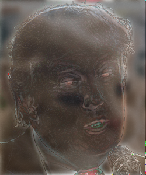
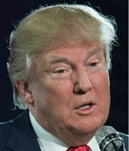
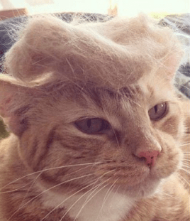

# Hybrid Image Generator

This project creates hybrid images by combining low and high frequency components from two input images using Fourier transforms.

## Demo

## Techniques Used
- Fourier Transform
- Frequency Filtering
- Gaussian Filters
- Perceptual Image Blending

## How to Run
1. `python hybrid.py`
2. Input: Two aligned images (same dimensions)
3. Output: Hybrid image

## Requirements
- numpy
- matplotlib
- OpenCV

## Source Images

| Trump Image | Cat Image |
|-------------|-----------|
|  |  |

## Hybrid Result

